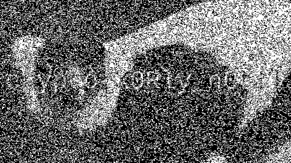

# XOR - Soluções

Soluções do módulo [XOR - CryptoHack.org](https://cryptohack.org/challenges/general/)

# Autores

- David Albuquerque. (github.com/Albuquerque-David)

# Sumário

- [XOR Starter](#XOR-Starter)
- [XOR Properties](#XOR-Properties)
- [Favourite Byte](#Favourite-Byte)
- [You either know, XOR you don't](#You-either-know,-XOR-you-don't)
- [Lemur XOR](#Lemur-XOR)

# XOR Starter

O problema já nos dá as informações necessárias para decodificar a mensagem. Para isto, basta pegar os valores inteiros da string apresentada e fazer o XOR com o 13 pra cada caractere. O resultado será a flag desejada.

```
13 -> 1101


l -> 108 -> 1101100 ^ 1101 -> a
a -> 97  -> 1100001 ^ 1101 -> l
b -> 98  -> 1100010 ^ 1101 -> o
e -> 101 -> 1100101 ^ 1101 -> h
l -> 108 -> 1101100 ^ 1101 -> a

```

FLAG: crypto{aloha}

# XOR Properties

Para encontrarmos a flag, podemos fazer algumas manipulações algébricas para encontrar a flag, dado que:

```
FLAG = KEY1 ^ KEY3 ^ KEY2 ^ 04ee9855208a2cd59091d04767ae47963170d1660df7f56f5faf
```

Para isto, vamos modificar algumas operações para isolar as variáveis.
```
KEY2 = KEY1 ^ 37dcb292030faa90d07eec17e3b1c6d8daf94c35d4c9191a5e1e
KEY2 = 911404e13f94884eabbec925851240a52fa381ddb79700dd6d0d
```
```
KEY3 = KEY2 ^ c1545756687e7573db23aa1c3452a098b71a7fbf0fddddde5fc1
KEY3 = 504053b757eafd3d709d6339b140e03d98b9fe62b84add0332cc
```

Logo, temos agora todas as 3 keys.

```
KEY1 = a6c8b6733c9b22de7bc0253266a3867df55acde8635e19c73313
KEY2 = 911404e13f94884eabbec925851240a52fa381ddb79700dd6d0d
KEY3 = 504053b757eafd3d709d6339b140e03d98b9fe62b84add0332cc
```

Agora, basta isolarmos a flag e realizar o XOR.

```
FLAG = KEY1 ^ KEY3 ^ KEY2 ^ 04ee9855208a2cd59091d04767ae47963170d1660df7f56f5faf
FLAG = 63727970746f7b7830725f69355f61737330633161743176337d
```

Transcrevendo o valor para ASCII, temos que

```
FLAG = crypto{x0r_i5_ass0c1at1v3}
```

FLAG: crypto{x0r_i5_ass0c1at1v3}


# Favourite Byte

Como a mensagem foi criptografada com apenas um byte e sabemos o começo da mensagem, podemos fazer um ataque de força bruta fazendo operações XOR em cada um dos dígitos da mensagem a ser decodificada:

```
73626960647f6b206821204f21254f7d694f7624662065622127234f726927756d
```

Com isto, podemos escrever um código que percorra cada um dos dígitos hexadecimais e realize operações XOR com números de 0x00 até 0xFF e converter o resultado para ASCII. Caso, após convertido para ASCII, seja encontrada a palavra "cripto" na string resultante, temos nossa chave.

```python
result = "73626960647f6b206821204f21254f7d694f7624662065622127234f726927756d"
bytes_result = bytearray.fromhex(result)

for i in range(0x00, 0xFF):
    flag = ""
    for byte in bytes_result:
        flag = flag + chr(byte ^ i)
    if 'crypto' in flag:
        break

print("FLAG: " + flag)
```

Output:
```
FLAG: crypto{0x10_15_my_f4v0ur173_by7e}
```

FLAG: crypto{0x10_15_my_f4v0ur173_by7e}

# You either know, XOR you don't

Novamente, como sabemos o começo da flag ( "crypto{" ), podemos fazer um XOR para tentar descobrir uma parte da chave utilizada para criptografar utilizando a string encriptada dada:

```
0e0b213f26041e480b26217f27342e175d0e070a3c5b103e2526217f27342e175d0e077e263451150104
```

Assim, pegando a conversão de "cripto{":

```
crypto{ = 63 72 79 70 74 6f 7b

63 72 79 70 74 6f 7b -> cripto{
0e 0b 21 3f 26 04 1e
6d 79 58 4f 52 6b 65 -> myXORkey
```

Como o resultado obtido já nos indica uma possível chave, podemos replicar está para o restante da string e ver se nos dá um resultado.

``` 
6d79584f526b65796d79584f526b65796d79584f526b65796d79584f526b65796d79584f526b65796d79
0e0b213f26041e480b26217f27342e175d0e070a3c5b103e2526217f27342e175d0e077e263451150104
63727970746f7b31665f7930755f4b6e30775f456e307547485f7930755f4b6e30775f31745f346c6c7d
```

A primeira linha representa a chave "myXORkey" repetidas vezes. A segunda linha é a mensagem encriptada e a terceira o XOR entre as duas.

Traduzindo a última linha, encontramos

```
crypto{1f_y0u_Kn0w_En0uGH_y0u_Kn0w_1t_4ll}
```

FLAG: crypto{1f_y0u_Kn0w_En0uGH_y0u_Kn0w_1t_4ll}

# Lemur XOR

Para resolução deste, foi utilizada a biblioteca Pillow do Python para realizar operações XOR em cima dos bytes das imagens. Para isto, foi escrito o seguinte código:

```python
from PIL import Image, ImageChops

#Armazena as imagens na variavel.

lemur = Image.open("lemur.png")
flag = Image.open("flag.png")

#Adiciona as imagens.

result = ImageChops.add(lemur, flag)
result.save("result_add.png")

#Subtrai as imagens.

result = ImageChops.subtract(lemur, flag)
result.save("result_subtract.png")

#XOR nas imagens.

lemur = lemur.convert('1')
flag = flag.convert('1')

result = ImageChops.logical_xor(lemur,flag)
result.save("result_xor.png")
```

Com isto, podemos obter resultados para as operações de adição, subtração e XOR das imagens lemur.png e flag.png.

<figure>
  
  <figcaption>Resultado da adição</figcaption>
</figure>

<figure>
  
  <figcaption>Resultado da subtração</figcaption>
</figure>

<figure>
  
  <figcaption>Resultado XOR</figcaption>
</figure>

Como pode ser visto mais claramente pela subtração, percebemos que a imagem da flag nos indica crypto{X0Rly_n0t!}.

FLAG: crypto{X0Rly_n0t!}

